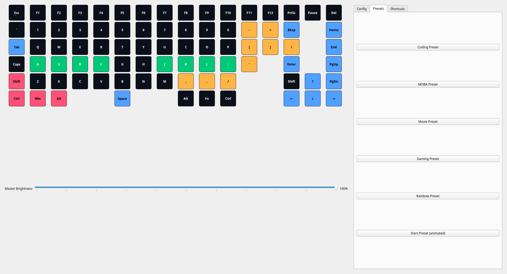
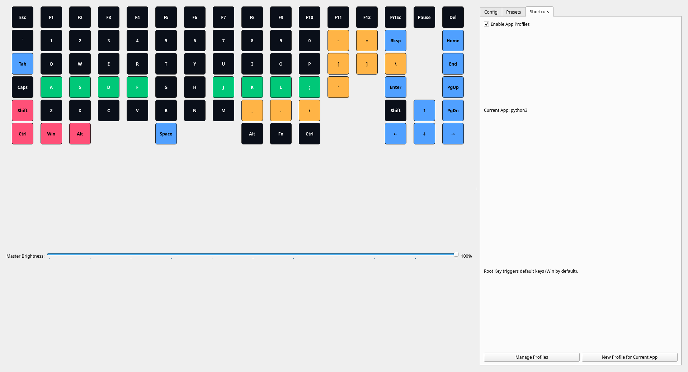
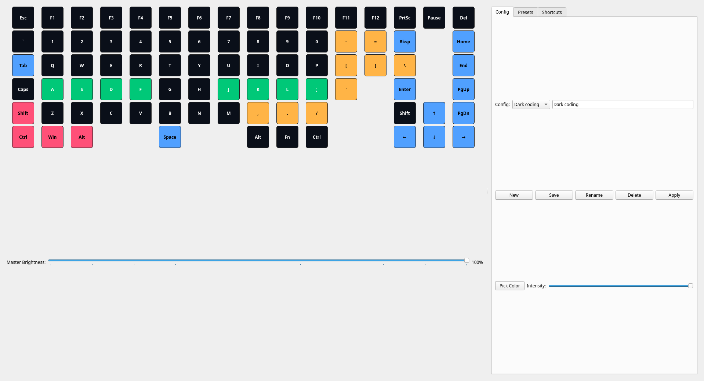

# Sinodragon – Hyprland-aware keyboard lighting

## Overview
Sinodragon is a PyQt-based app that controls per-key RGB lighting on supported keyboards. It reacts to the currently focused application on Hyprland (Wayland) via the events socket and can highlight app-specific shortcuts on key press. It also supports a global fallback profile, live UI editing, presets, and a background daemon mode from the system tray.

NOTE: This only work for Redragon keybaord with sinowealth chip. (pid : 0x0049 , vendor: 0x258A). This will not work for older Redragon keyboards (use openrgb). If you have other keyboard, you need to modify the keyboard_controller.py to support your keyboard. 

## Key features
- Live LED updates while editing colors in the UI
- Hyprland IPC driven app detection (no polling, no hyprctl)
- App-specific profiles (default keys and modifier-combo highlighting)
- Global profile fallback when app has no defaults/combos, and for apps with no profile
- Baseline configuration used when there is no active window
- Right-side tab panel: Config, Presets, Shortcuts
- System tray + daemon mode (run in background)
- Optional evdev-based key monitoring for low-latency modifier detection





## Requirements
- Python 3.8+
- Linux + Hyprland (Wayland)
- Packages (from requirements.txt):
  - PyQt5
  - hidapi
  - pillow
  - evdev (optional, recommended for global key monitoring)

## Install
```bash
pip install -r requirements.txt
```

## Run
- With the packaged entrypoint (if installed):
```bash
sinodragon --gui
```
- Or via Python directly in this repo:
```bash
python -m sinodragon.main --gui
```

### Logging
- Set `DEBUG=true` in the environment to enable informative logs:
```bash
DEBUG=true sinodragon --gui
```
- Without `DEBUG`, only warnings and above are logged.

## Hyprland IPC
- The app listens on Hyprland’s events socket to detect active window changes:
  - Preferred path: `$XDG_RUNTIME_DIR/hypr/$HYPRLAND_INSTANCE_SIGNATURE/.socket2.sock`
  - Fallback discovery: `$XDG_RUNTIME_DIR/hypr/*/.socket2.sock` then `/tmp/hypr/*/.socket2.sock`
- Event format handled: `activewindow>>CLASS,TITLE`.
- Blank/none events reset the keyboard to the baseline configuration.

### UI walkthrough
- Left: your keyboard layout view (click keys to color them using the current picker).
- Right panel tabs:
  - Config: select/load, New/Save/Rename/Delete, Apply, color picker, intensity slider.
  - Presets: coding, gaming, movie, rainbow, stars.
  - Shortcuts: enable/disable app profile monitoring, view current app, open Profiles manager.

### Live editing
- Click “Pick Color”, then click keys on the keyboard; LEDs update immediately.
- Intensity slider changes are applied live.

### Configurations (baseline)
- Config files are stored under `~/.config/sinodragon/configs/*.json`.
- Loading or saving a config snapshots the “baseline”. Baseline is applied:
  - When the active window is blank/none
  - When no app/global defaults exist

## App profiles
- Profiles are stored under `~/.config/sinodragon/app_profiles/*.json`.
- Open “Manage Profiles” from the Shortcuts tab.
- Each profile can define:
  - `default_keys`: keys to highlight whenever that app is focused
  - `combos`: modifier-based combinations to highlight while held (e.g., `Ctrl`, `Ctrl+Shift`)

## Global profile
- Create a profile named `global` to provide fallback behavior:
  - If an app has a profile but no `default_keys`, the app will use `global.default_keys` if present
  - If an app has no profile, `global.default_keys` is used
  - For modifier combos (e.g., `Ctrl`, `Ctrl+Alt`), if an app does not define a combo, the `global` profile’s combo is used

## Notes on combos
- Combos use only modifiers in this build: `Ctrl`, `Shift`, `Alt`, `Win`, or combinations (e.g., `Ctrl+Shift`).
- Combos highlight only while the modifiers are held; upon release, the app’s default keys (or global defaults) are restored.
- Root trigger: press `Win+Delete` to re-apply the app’s default keys.

## Daemon mode (system tray)
- The app creates a tray icon with menu actions:
  - Show Window
  - Toggle App Profiles
  - Enter/Exit Daemon Mode
  - Quit
- Daemon mode hides the main window but keeps monitoring and lighting active.

## Performance and efficiency
- Hyprland integration is event-driven and non-blocking.
- Rendering is minimized using a simple view-state machine (baseline | app_default | combo) to avoid redundant LED pushes.
- A small LRU cache (size 5) is used for app profiles; the `global` profile is cached separately.

## Troubleshooting
- Current App stays “Unknown”:
  - Ensure Hyprland sets `HYPRLAND_INSTANCE_SIGNATURE` and `XDG_RUNTIME_DIR` in your session
  - Confirm events socket exists under `$XDG_RUNTIME_DIR/hypr/<sig>/.socket2.sock` (or `/tmp/hypr/<sig>/.socket2.sock`)
- Combos not highlighting:
  - Only modifier combos are supported (e.g., `Ctrl`, `Ctrl+Shift`). Non-modifier combos (e.g., `Win+X`) are not used in this build
  - Ensure “Enable App Profiles” is checked
  - Verify the combo exists in the app profile or in the `global` profile
- Key presses not detected globally:
  - `evdev` may require permissions; if unavailable, only UI-based key events are processed

## Development
- Main entry: `ui/app_v2.py`
- Hyprland IPC: `core/hypr_ipc.py`
- Input monitoring: `core/input_monitor.py`
- Lighting controller: `core/lighting.py`
- Profiles: `core/app_profiles.py`, dialog at `ui/dialogs/app_profiles_v2.py`


